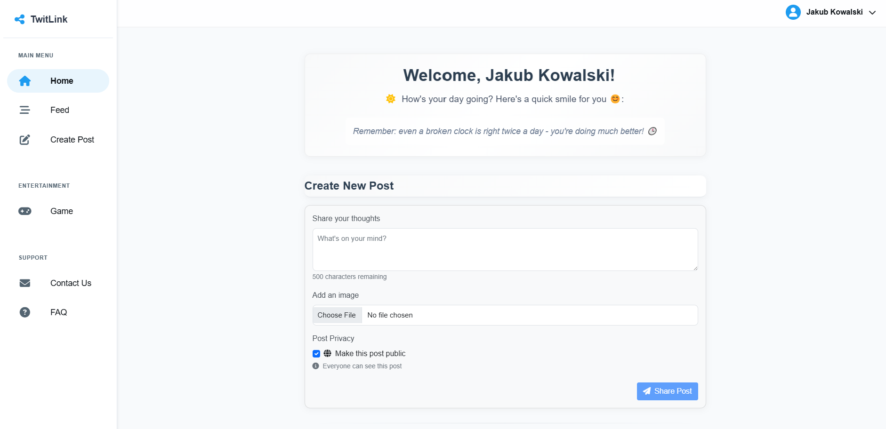
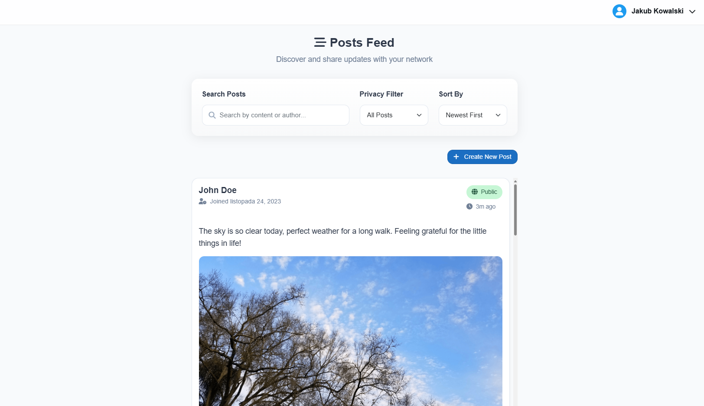

# TwitLink - Social Media Application - TTSAWN Project

TwitLink is a social media platform built with .NET 8 and Blazor WebAssembly, featuring a microservices architecture, created for college project.

## Application Preview

### Login Screen

*TwitLink's secure login interface*

### Home Page

*Main application page*

### Posts View

*View of user posts*

## Prerequisites

- Docker Desktop
- Git
- Visual Studio

## Getting Started

1. Clone the repository:
   ```bash
   git clone https://github.com/WojtekMAGH/TTSAWN-Projekt-zaliczeniowy-WM-SJ.git
   cd [clone target folder]
   ```

2. Build and run the application using Docker Compose:
   ```bash
   docker-compose build --no-cache
   docker-compose up -d
   ```

3. Access the application:
   - Open your web browser
   - Navigate to `http://localhost:5000`
   - Test application (Register a new account or log in)

## Service URLs

- Frontend - Web Application: `localhost:5000`
- Identity API: `localhost:5001/swagger`
- Post Service API: `localhost:5002/swagger`
- User Service API: `localhost:5003/swagger`
- SQL Server: `localhost,1433`

## Architecture

The application is built using a microservices architecture with the following components:

- **Blazor Client** (Port 5000): Frontend web application
- **Identity API** (Port 5001): Handles authentication and authorization
- **Post Service API** (Port 5002): Manages post-related operations
- **User Service API** (Port 5003): Handles user management
- **MSSQL Database** (Port 1433): Data storage

## Environment Variables

The application uses various environment variables for configuration. These are already set in the docker-compose.yml file, but can be modified if needed.

## License

This project is licensed under the MIT License - see the [LICENSE.md](LICENSE.md) file for details

## Acknowledgments

- Built with .NET 8 and Blazor WebAssembly
- Uses Docker for containerization
- SQL Server for data storage
